<p align="center">
  
</p>

<h1 align="center">eagle-scout-extension</h1>

<p align="center"><b>Docker Scout security scanning, as a tab inside Docker Desktop.</b> The visual companion to the <a href="https://github.com/ry-ops/eagle-scout">eagle-scout</a> MCP server — a dashboard of your images and their vulnerabilities, right where you already work.</p>

<p align="center">
  
  
  <a href="https://github.com/ry-ops/eagle-scout"></a>
</p>

---

## How it's built

<p align="center">
  
</p>

| Part | What it is |
|---|---|
| [`ui/`](ui/) | the dashboard tab (`index.html`) |
| [`backend/`](backend/) | a Go backend (`main.go`) the UI talks to on port 8888 |
| [`metadata.json`](metadata.json) | extension metadata — title, icon, dashboard tab, compose file |
| [`compose.yaml`](compose.yaml) | runs the backend inside the extension VM |

## Install

The image isn't on Docker Hub yet, so build it from source:

```bash
docker build -t ryops/eagle-scout-extension:dev .
docker extension install ryops/eagle-scout-extension:dev
```

Pushing a `v*` tag runs the [release workflow](.github/workflows/release.yml), which publishes to Docker Hub (`ryops/eagle-scout-extension`) and GHCR (`ghcr.io/ry-ops/eagle-scout-extension`).

## Pairs with

Prefer to drive Scout from your AI assistant instead of a UI? Use the [eagle-scout](https://github.com/ry-ops/eagle-scout) MCP server — same Docker Scout power, 14 tools, over MCP.

<!-- org-footer -->
---

<p align="center"><sub>Part of <a href="https://github.com/ry-ops">ry-ops</a> · building the pipes between infrastructure, automation, and observability · built by <a href="https://github.com/ry-ops">ry-ops</a></sub></p>
