<p align="center"></p>

# eagle-scout-extension

**Eagle Scout** as a Docker Desktop extension: a Docker Scout security-scanning dashboard inside Docker Desktop. It's the visual companion to the [eagle-scout](https://github.com/ry-ops/eagle-scout) MCP server.

| Part | What it is |
|---|---|
| [`ui/`](ui/) | The dashboard tab (`index.html`) |
| [`backend/`](backend/) | A Go backend (`main.go`) the UI talks to on port 8888 |
| [`metadata.json`](metadata.json) | Extension metadata: title, icon, dashboard tab, compose file |
| [`compose.yaml`](compose.yaml) | Runs the backend inside the extension VM |

## Install

The image isn't published to Docker Hub yet, so build it from source:

```bash
docker build -t ryops/eagle-scout-extension:dev .
docker extension install ryops/eagle-scout-extension:dev
```

Pushing a `v*` tag runs the [release workflow](.github/workflows/release.yml), which publishes the image to Docker Hub (`ryops/eagle-scout-extension`) and GHCR (`ghcr.io/ry-ops/eagle-scout-extension`).

<!-- org-footer -->
---

<p align="center"><sub>Part of <a href="https://github.com/ry-ops">ry-ops</a> · building the pipes between infrastructure, automation, and observability · built by <a href="https://github.com/ry-ops">ry-ops</a></sub></p>
